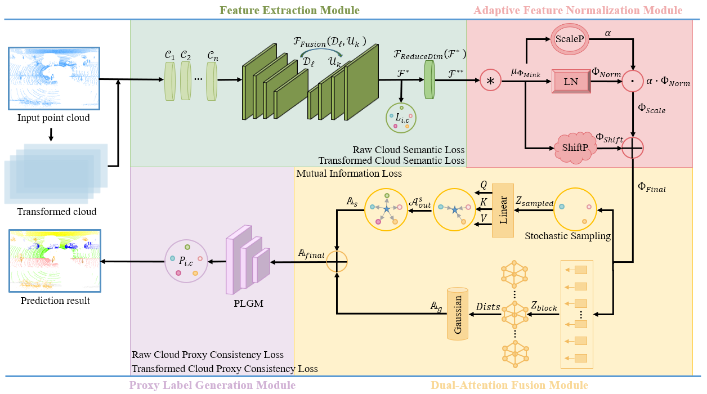

# Weather-Aware Autopilot Domain Generalization for Point Cloud Semantic Segmentation



## Overview

WADG-PointSeg is a robust deep learning framework designed to enhance the semantic segmentation of 3D point clouds under diverse weather conditions. It utilizes a domain generalization approach to train models that generalize well to unseen target domains, making it particularly suitable for autonomous driving and similar applications.

## Installation

Follow the steps below to set up the environment and install the necessary dependencies:

1. Load required modules:

    ```bash
    module load libfabric/1.10.1 
    module load openmpi/4.0.3
    module load ucx/1.8.0
    module load cuda/11.4
    module load python/3.8.2
    ```

2. Clone the repository and navigate into the project directory:

    ```bash
    git clone https://github.com/J2DU/WADG-PointSeg.git
    cd WADG-PointSeg
    ```

3. Install required Python packages:

    Create a virtual environment and activate it (optional but recommended):

    ```bash
    python3 -m venv venv
    source venv/bin/activate
    ```


4. Run the training script:

    To start training, use the provided `train.py` script. You can adjust the configurations by modifying the YAML files in the `configs/` directory.

    ```bash
    python train.py --config configs/kitti.yaml
    ```

## Datasets

The following datasets are used in this project:

- [SemanticKITTI](http://www.semantic-kitti.org/)
- [SynLiDAR](https://github.com/xiaoaoran/SynLiDAR)
- [SemanticSTF](https://github.com/xiaoaoran/SemanticSTF)

Please download the datasets from the respective links and follow the instructions provided by the dataset authors to set them up.

## Usage

1. **Training**: Modify the configuration files as needed and run the training script using the appropriate configuration file.

    ```bash
    python train.py --config configs/kitti.yaml
    ```
    ```bash
    python train.py --config configs/synlidar.yaml
    ```
## Acknowledgments

We would like to express our gratitude to the following open-source projects that significantly contributed to this work:

- [SemanticSTF](https://github.com/xiaoaoran/SemanticSTF)
- [MinkowskiNet](https://github.com/chrischoy/SpatioTemporalSegmentation)

## License

This project is licensed under the MIT License - see the [LICENSE](LICENSE) file for details.

